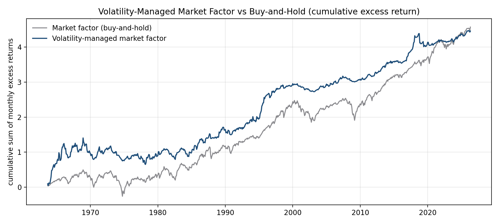

# Volatility-Managed Factor Portfolios

A replication and extension of **Moreira & Muir (2017), "Volatility-Managed Portfolios"** on the
Fama-French 5 factors plus Momentum. The question: if you scale a factor's exposure by the inverse
of its recent realized variance, does risk-adjusted performance improve? The honest answer is
**it depends strongly on the factor** - volatility timing earns large, significant alpha on the
crash-prone factors (momentum and profitability) and does nothing for size, value, or investment.

Built on the Ken French Data Library (daily FF5 + Momentum, 1963-2026). No API keys.

```
python src/vol_managed_factors.py
```

## Headline result

For each factor `f`, the volatility-managed version is `f_managed[m] = (c / RV[m-1]) * f[m]`, where
`RV[m-1]` is the realized variance over the prior month (sum of squared daily returns) and `c` is a
single constant chosen so the managed series matches the original's full-sample volatility. The
timing signal `1/RV[m-1]` uses only past data, so the leverage decision is out-of-sample; `c` is a
scale-only normalization that affects neither the Sharpe ratio nor the spanning-regression t-stat.

The Moreira-Muir test regresses the managed factor on the original, `f_managed = alpha + beta*f + e`;
a positive significant `alpha` means volatility timing earns return the buy-and-hold factor does not
span. Full sample, monthly, net of 14 bps per unit of leverage turnover, Newey-West (HAC, 6 lags)
t-statistics:

| Factor | Sharpe (orig) | Sharpe (managed) | Sharpe (net of costs) | Spanning alpha (ann.) | t-stat |
|---|---|---|---|---|---|
| **Momentum** | 0.51 | **0.89** | 0.81 | **+8.9%** | **5.03** |
| **RMW (profitability)** | 0.41 | **0.54** | 0.41 | **+2.3%** | **2.87** |
| Mkt-RF | 0.48 | 0.46 | 0.40 | +2.1% | 1.37 |
| HML (value) | 0.37 | 0.35 | 0.26 | +1.4% | 1.21 |
| CMA (investment) | 0.42 | 0.32 | 0.19 | +0.3% | 0.45 |
| SMB (size) | 0.15 | 0.09 | 0.01 | -0.2% | -0.18 |



## What the result means

- **Momentum is the standout** (alpha 8.9%/yr, t=5.0; net Sharpe 0.81 vs 0.51). This is consistent
  with Barroso & Santa-Clara (2015), "Momentum Has Its Moments": momentum crashes happen in
  high-volatility states, so cutting exposure when variance spikes avoids the worst of them.
- **Profitability (RMW)** also benefits significantly (t=2.9). Both winners are factors with strong
  negative volatility-return dynamics and fat left tails.
- **Size, value, and investment do not benefit** - their volatility carries less information about
  future returns, so timing them adds turnover without alpha.
- The **market factor's** managed alpha is positive but insignificant over the full 1963-2026 sample,
  weaker than in Moreira & Muir's original window - an honest sign of partial decay as the result
  became known.

This is a performance-attribution and factor-timing study, not a live trading system: the `1/RV`
weights can imply large leverage, so the table reports turnover and net-of-cost Sharpe, and a real
implementation would cap leverage (which would shrink the gains).

## Secondary analyses

These came first historically and now serve as context for the volatility-timing work above.

**1. Sector factor attribution.** FF3, Carhart 4-factor, and FF5 regressions on the 11 SPDR sector
ETFs (XLK, XLF, XLV, ...). The models explain ~92-93% of the technology sector's daily variance;
tech shows market beta > 1, a large-cap tilt (negative SMB), and a growth tilt (negative HML), and
adding Momentum and RMW measurably improves fit. Rolling-window regressions visualize time-varying
betas: a market-wide correlation spike in the 2020 crash and the 2022 growth-to-value rotation.

**2. Sector-momentum baseline (honest).** A top-3-of-11 sector rotation by trailing 6-month momentum,
rebalanced monthly. Net of costs it returns 9.5% vs SPY's 12.0%, Sharpe 0.53 vs 0.68, with alpha of
-1.1% (t=-0.48) - it lowers max drawdown (-16.4% vs -24.8%) but does **not** beat SPY on a
risk-adjusted basis. That negative result is exactly what motivates the volatility-timing extension:
naive cross-sectional momentum is hard to monetize, while timing a factor by its own variance is not.

## Repository

```
src/vol_managed_factors.py        Moreira-Muir analysis (this README's headline)
output/vol_managed_metrics.csv    full per-factor metrics
output/figures/                   cumulative market factor, Sharpe comparison
expanding_the_factor_models.ipynb FF3 / Carhart / FF5 sector attribution
sector_rotation_strategy.ipynb    sector-momentum baseline
cross_sectional_analysis.ipynb    rolling-beta heatmaps
paper/paper_equity_factor.tex     write-up
```

## References

- Moreira, A. & Muir, T. (2017). Volatility-Managed Portfolios. *Journal of Finance* 72(4).
- Barroso, P. & Santa-Clara, P. (2015). Momentum Has Its Moments. *Journal of Financial Economics* 116(1).
- Fama, E. & French, K. (2015). A Five-Factor Asset Pricing Model. *Journal of Financial Economics* 116(1).

*Data: Kenneth R. French Data Library. This is a research/educational project, not investment advice.*
